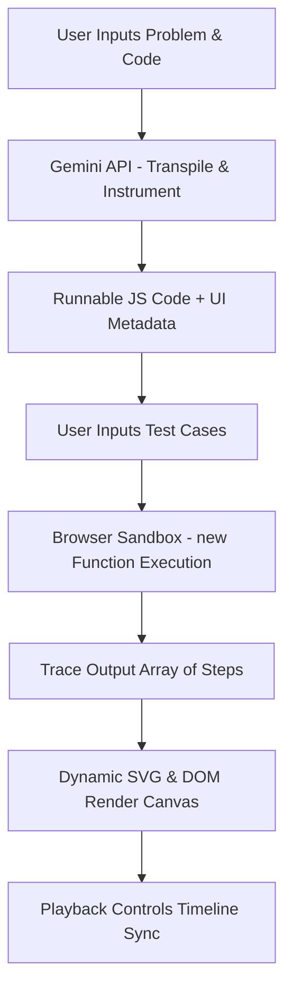

# AlgoLens - Universal LeetCode Visualizer

AlgoLens is an interactive, premium client-side web application designed to visualize **any** LeetCode problem and solution code step-by-step. 

It runs completely in your browser for **$0 cost**, using a Gemini API Key (on the free tier) to translate your solution into instrumented JavaScript, running it in a local sandbox, and rendering animations of arrays, grids, trees, graphs, disjoint sets, and recursion stacks.

---

## 🚀 Key Features

* **Zero Server Overhead ($0 Cost)**: Runs entirely client-side. Transpilation is done via the Gemini API, and execution runs locally.
* **Multi-Language Support**: Write your solution in **Java, Python, C++, JavaScript, TypeScript, Go, Rust, or C#**. 
* **Dynamic Visualization Engine**:
  * **1D Arrays**: Pointer animations (Two Pointers, Binary Search, Sorting).
  * **2D Grids & DP Tables**: Matrix rendering showing row/col lookups and paths (Dynamic Programming).
  * **Trees & Tries**: Auto-layouts for Binary Trees, N-ary Trees, and Prefix Tries. Supports LeetCode tree serialization arrays (e.g. `[3,9,20,null,null,15,7]`).
  * **Graphs**: Circular graph node clusters showing DFS/BFS traversal sequences.
  * **Disjoint Sets**: Parent array visuals alongside parent-child node tree groups.
  * **Recursion Stack**: Stack logs tracking backtracking steps and depth levels.
* **Premium IDE Theme**: Styled with a dark industrial design, featuring solid charcoal panels, custom scrollbars, orange/amber active indicators, and emerald visited tracks. (Strictly no blue and no glassmorphism).
* **Playback Controls**: Timeline seek slider, Play/Pause, Step Forward/Backward, and Speed adjustments (100ms - 2s steps).
* **Variable Watch & Log history**: Tracks variables and accumulates step explanations.

---

## 🛠️ How It Works (Client-Side Architecture)

AlgoLens does not require a backend server because it executes everything in the browser:



1. **Transpilation**: Gemini translates your code solution (e.g., Python/Java) into equivalent JavaScript. It instruments the JS code by adding trace capture blocks (`trace.push(...)`) at each line.
2. **Local Sandbox**: The app parses your LeetCode test cases and compiles the instrumented JS code using `new Function()`.
3. **Execution & Animate**: The code runs locally on your machine, outputting a list of state snapshots (trace). The visualization engine plays it back without ever hitting the API again.

---

## 💻 Running Locally

Since this is a JavaScript-based project, you can run it locally using Node.js/NPX (recommended) or Python:

### Node.js (npx)
```bash
# Serves the application on http://localhost:3000 (or first available port)
npx serve .
```

### Python (Alternative)
```bash
# Serves the application on http://localhost:8000
python -m http.server 8000
```

---

## 🌐 Free Deployments

Because it has no backend, you can host AlgoLens for free on **GitHub Pages**:

1. Create a repository on GitHub (e.g., `AlgoLens`).
2. Initialize git and push your code:
   ```bash
   git init
   git add .
   git commit -m "Initial commit"
   git branch -M main
   git remote add origin https://github.com/Flashyrs/AlgoLens.git
   git push -u origin main
   ```
3. Open your GitHub repository in your browser.
4. Go to **Settings** -> **Pages**.
5. Set the Source to **Deploy from a branch**, select `main` (root `/`), and click **Save**.
6. Your visualizer will be live at `https://<your-username>.github.io/AlgoLens/`.
